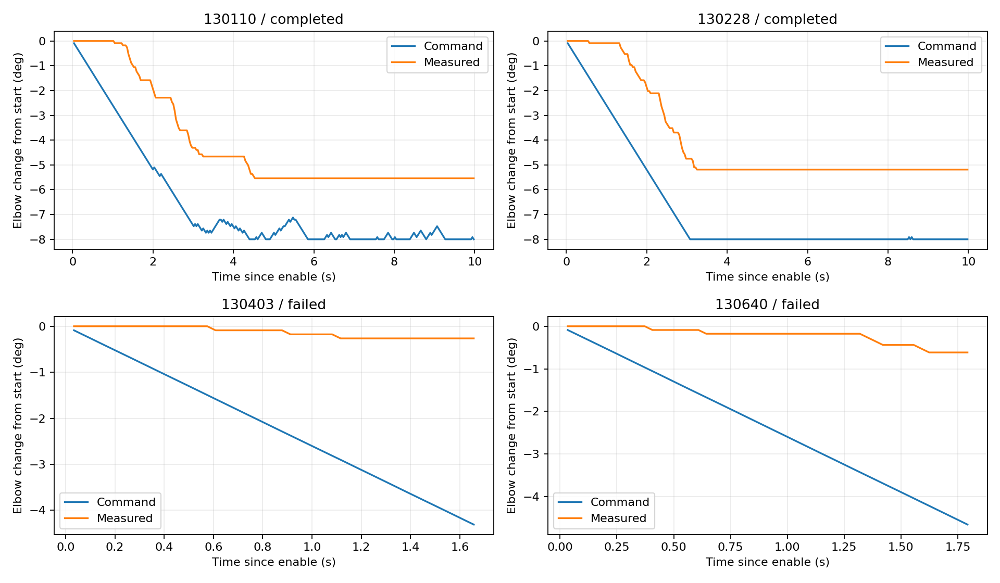
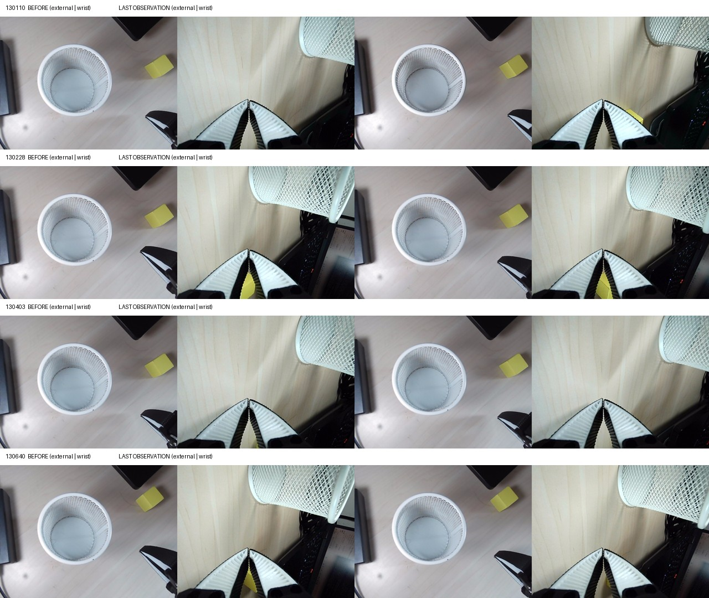

# return1：实机受限执行回传复核

结论：双相机 → 10k BF16 推理 → 限幅 → 电机命令这条链路已经在本机跑通两次完整的 10 秒试验，但目前不宜扩大动作范围或开启完整抓取。两次提前停止集中在肘关节跟随不足；此外，首次启动存在未解释的扭矩状态变化及旧代码的清理遗漏，应先做只读电机诊断。

## 回传完整性

共 10 个 ZIP，CRC 全部通过，回传所记录的 Python 文件 SHA256 全部匹配交付版本。所有存在的预测数组均为有限值、50×6 动作序列，使用 010000 权重、BF16、RTX 5060 Laptop、PyTorch 2.10.0+cu128。并未发现用户改过这些 Python 文件的证据。

| 本机文件时间 | 模式 | 结果 |
|---|---|---|
| 12:54:00 | DryRun | 完整 10 秒，295 周期，电机写包为 0，扭矩前后全为 0 |
| 12:55:22 | Execute | 启动对齐期间 `Incorrect status packet`；0 个控制周期，1 次目标位置写入；退出读到六路扭矩全为 1 |
| 12:57:47 | Execute | 因扭矩已开启而拒绝启动，0 次写入 |
| 12:58:36 | Release | 六路扭矩由 1 变为 0，回读成功 |
| 12:59:04 | Execute | 模型预检期间位置变化超过 2 tick，0 次写入，扭矩保持 0 |
| 13:01:10 | Execute | 完整 10 秒，295 周期，298 次写包，退出保持回读成功 |
| 13:02:28 | Execute | 完整 10 秒，295 周期，298 次写包，退出保持回读成功 |
| 13:03:37 | Release | 六路扭矩由 1 变为 0，回读成功 |
| 13:04:03 | Execute | 49 个周期后，跟随误差触发停止；52 次写包，保持回读成功 |
| 13:06:40 | Execute | 53 个周期后，跟随误差触发停止；56 次写包，保持回读成功 |

四次进入控制循环的 Execute 结束时，扭矩均读为 1。最新一包也如此；日志不能证明此后机器是否仍通电或是否被人工释放。用户对接触、断电、释放和重摆等操作回复“应该没有，我忘了”，因此现场历史记为未确认。有些连续运行的结束扭矩为 1、下一次开始为 0，中间变化无法由现有包解释。

## 已验证的执行和推理表现

成功的两次控制周期中位数约 33.81 ms，平均频率约 29.57 Hz，单次控制工作耗时中位数约 1.9 ms。10 秒均记录 295 次控制命令；加上对齐、开启扭矩及结束保持，共 298 个写包。

真实完整 50 步模型推理加前后处理，中位数分别为 382.89 ms、387.56 ms；不能把 1.9 ms 控制工作耗时当成推理速度。当前正在采用的动作，其源观察年龄中位数约 618/622 ms，最大约 819/851 ms。相机输入年龄 P95 约 32–33 ms。

模型峰值 allocated 928.27 MiB、reserved 958 MiB，这是 PyTorch 分配器统计，并非 Windows 整卡总显存。各次没有陈旧计划拒收或序列耗尽保持记录。相比上一轮约 0.9 秒的完整推理，这次约 0.38–0.39 秒，属于本次运行实测改善；并未做受控实验确定改善原因。

重新逐行核验所有有控制记录的运行：目标每次最多变化 1 tick、位于启动偏移/标定范围交集内，夹爪目标不变。两次成功试验的肘关节目标偏移都到达 8°限制，实测最大偏移分别约 5.54°和 5.19°；成功不等于关节准确跟随。

## 肘关节跟随不足

| 项目 | 13:04:03 | 13:06:40 |
|---|---:|---:|
| 最后成功记录时间 | 1.657 s | 1.793 s |
| 肘关节目标相对起点变化 | −4.308° | −4.659° |
| 肘关节实测相对起点变化 | −0.264° | −0.615° |
| 最后已记录的写入前跟随误差 | 3.956° | 3.956° |
| 停止保持读数相对最后目标差 | 4.044° | 4.044° |

触发异常的那一轮读数没有写入 `control.jsonl`，因此不能把停止保持读数冒充触发时刻的原始数据。不过两次最后有效周期、异常堆栈及随后保持读数相互一致，均指向肘关节跟随不足。下一版需要把失败周期的关节名、实测值和目标也保存。

目标持续推进、实测肘关节推进很少，说明需要检查电机控制/机械负载/状态，现阶段不能归因为模型坏了，也不能确定是接触、供电、扭矩限制或已有控制参数中的哪一项。不应简单把 4°阈值放宽来让测试继续。

## 启动异常及代码遗漏

12:55:22 的日志清楚显示：

1. 连接时扭矩六路均为 0。
2. 唯一发出的写包来自当前位置对齐的 Goal_Position 写入。
3. 下一次 Present_Position 读取报 `Incorrect status packet`；显式 Torque_Enable 写入尚未执行。
4. 最终退出读取扭矩六路均为 1，但 `stop_hold` 为空。

这些记录不能证明“目标位置写入必然自动开启扭矩”，也不能排除固件行为、其他控制来源或通信读回异常。读取代码没有足够证据区分这些原因。所查原厂 STS3215 资料涉及位置命令与某些保护状态的交互，但不能据此推断这台设备的具体行为；不同硬件/固件的适用性仍未确认。[原厂规格书镜像](https://core-electronics.com.au/attachments/uploads/sts3215-smart-servo-datasheet-translated.pdf)

旧程序确实存在清理覆盖不足：`may_be_enabled` 在显式开扭矩前才设为 True，因此第一条目标写入后发生异常时，清理逻辑不会尝试保持。已在独立 `startup_fix_candidate/` 中修正为首次目标写入前就标记状态不确定，并在对齐回读后额外核对扭矩仍为 0。两个针对“目标写入伴随扭矩变化”和“首次写入异常”的回归测试通过。

该修正仅是待后续整合验证的候选，不是已验证的实机修复。原交付包保留不动用于追溯；本轮不提供新的 Execute 包，不建议用户自行覆盖候选文件后继续动作。

## 图像复核与结论边界

已查看四次进入执行循环的起始和末次双相机图。两次完整运行的腕部视角有可见变化，黄块和网篮仍在桌面；两次提前停止的画面变化较小。画面不完整展示肘关节及周边支撑，不能据此排除机械接触。

夹爪在本轮固定，多数关节预测经过大量限幅。例如两次成功运行肘关节的限幅周期比例约 96.6%/99.7%。所以这不是原始策略的完整抓取执行，也不能据此计算抓取成功率或认定 10k 策略抓取有效。

## 下一步交付

提供 `motor_diagnostic_kit.zip`：只读取 15 秒电机状态和已有配置，复用底层只读包门控，不加载模型、不打开相机、不写位置/扭矩/PID。诊断保持当时的扭矩状态，本身不会释放机械臂。

先关闭其他控制程序，保持稳定支撑运行诊断。回传日志后，再核对肘关节模式、限矩、负载、电流、电压、温度和状态字；静止诊断只能缩小范围，不能排除运动时才出现的问题。

分析数据在 `ANALYSIS.json`；`analyze.py` 可从原始 ZIP 重建结果。原始文件均未修改。
